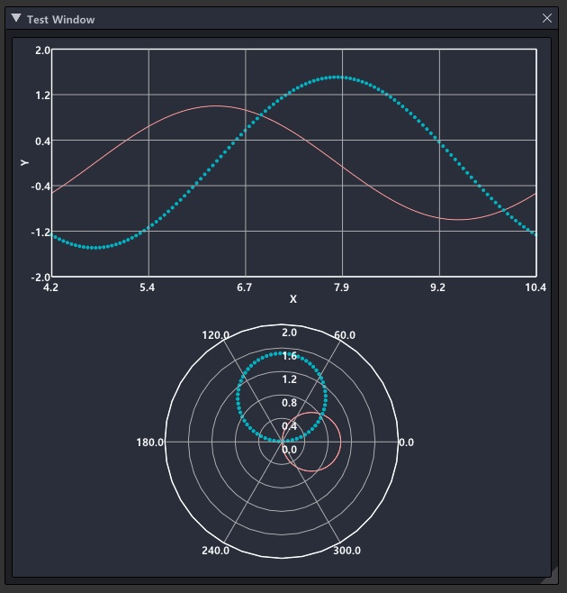

# ImGuiPlotter
Scientific plotting function from ImGui. Thie requirement ImGui.

# Install
You just include <ImGuiPlotter> only!!

# How to Use
	std::shared_ptr<ImGuiPlotter<float>> sPlotter = make_shared<ImGuiPlotter<float>>();
	std::shared_ptr<ImAxes<float>> sAxes = make_shared<ImAxes<float>>();
	std::shared_ptr<ImPlot<float>> sPlot = make_shared<ImPlot<float>>();

	std::vector<float> xdata, ydata;

	for (int i = 0; i < 121; ++i) {
		xdata.emplace_back(radians(3.f * i));
		ydata.emplace_back(1.f * cos(xdata[i]));
	}

	sPlot->SetData(xdata,ydata);

	sAxes->xlim = ImVec(0.f, 3.141592f);
	sAxes->ylim = ImVec(-2.f, 2.f);
	sAxes->xPrecision = 1;
	sAxes->yPrecision = 1;
	sAxes->xlabel = L"X";
	sAxes->ylabel = L"Y";
	sAxes->AddImPlot(sPlot);

	sPlotter->frameSize = { 600,600 };
	sPlotter->AddImAxes(sAxes, 0);

	ImGui::Begin("Test");
	sPlotter->Render();
	ImGui::End();
